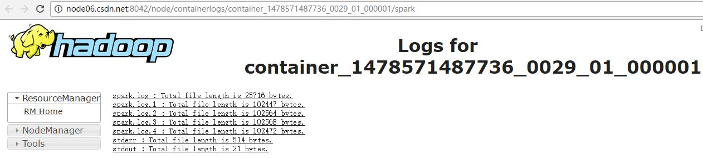

# Spark Streaming Logging Configuration
Spark Streaming applications tend to run forever, so their log files should be properly handled, to avoid exploding server hard drives. This article will give some practical advices of dealing with these log files, on both Spark on YARN and standalone mode.

## Log4j’s RollingFileAppender

Spark uses log4j as logging facility. The default configuraiton is to write all logs into standard error, which is fine for batch jobs. But for streaming jobs, we’d better use rolling-file appender, to cut log files by size and keep only several recent files. Here’s an example:
```
log4j.rootLogger=INFO, rolling
log4j.appender.rolling=org.apache.log4j.RollingFileAppender
log4j.appender.rolling.layout=org.apache.log4j.PatternLayout
log4j.appender.rolling.layout.conversionPattern=[%d] %p %m (%c)%n
log4j.appender.rolling.maxFileSize=50MB
log4j.appender.rolling.maxBackupIndex=5
log4j.appender.rolling.file=/var/log/spark/${dm.logging.name}.log
log4j.appender.rolling.encoding=UTF-8
log4j.logger.org.apache.spark=WARN
log4j.logger.org.eclipse.jetty=WARN
log4j.logger.com.anjuke.dm=${dm.logging.level}
```
This means log4j will roll the log file by 50MB and keep only 5 recent files. These files are saved in /var/log/spark directory, with filename picked from system property dm.logging.name. We also set the logging level of our package com.anjuke.dm according to dm.logging.level property. Another thing to mention is that we set org.apache.spark to level WARN, so as to ignore verbose logs from spark.

## Standalone Mode

In standalone mode, Spark Streaming driver is running on the machine where you submit the job, and each Spark worker node will run an executor for this job. So you need to setup log4j for both driver and executor.

For driver, since it’s a long-running application, we tend to use some process management tools like supervisor to monitor it. And supervisor itself provides the facility of rolling log files, so we can safely write all logs into standard output when setting up driver’s log4j.

For executor, there’re two approaches. One is using `spark.executor.logs.rolling.strategy` provided by Spark 1.1 and above. It has both time-based and size-based rolling methods. These log files are stored in Spark’s work directory. You can find more details in the documentation.

The other approach is to setup log4j manually, when you’re using a legacy version, or want to gain more control on the logging process. Here are the steps:
1. Make sure the logging directory exists on all worker nodes. You can use some provisioning tools like ansbile to create them.
2. Create driver’s and executor’s log4j configuration files, and distribute the executor’s to all worker nodes.
3. Use the above two files in spark-submit command:
```
spark-submit
  --master spark://127.0.0.1:7077
  --driver-java-options "-Dlog4j.configuration=file:/path/to/log4j-driver.properties -Ddm.logging.level=DEBUG"
  --conf "spark.executor.extraJavaOptions=-Dlog4j.configuration=file:/path/to/log4j-executor.properties -Ddm.logging.name=myapp -Ddm.logging.level=DEBUG"
  ...
```

## Spark on YARN

YARN is a resource manager introduced by Hadoop2. Now we can run differenct computational frameworks on the same cluster, like MapReduce, Spark, Storm, etc. The basic unit of YARN is called container, which represents a certain amount of resource (currently memory and virtual CPU cores). Every container has its working directory, and all related files such as application command (jars) and log files are stored in this directory.

When running Spark on YARN, there is a system property spark.yarn.app.container.log.dir indicating the container’s log directory. We only need to replace one line of the above log4j config:
```
log4j.appender.rolling.file=${spark.yarn.app.container.log.dir}/spark.log
```
And these log files can be viewed on YARN’s web UI:



The spark-submit command is as following:
```
spark-submit
  --master yarn-cluster
  --files /path/to/log4j-spark.properties
  --conf "spark.driver.extraJavaOptions=-Dlog4j.configuration=log4j-spark.properties"
  --conf "spark.executor.extraJavaOptions=-Dlog4j.configuration=log4j-spark.properties"
  ...
```
As you can see, both driver and executor use the same configuration file. That is because in yarn-cluster mode, driver is also run as a container in YARN. In fact, the spark-submit command will just quit after job submission.

If YARN’s log aggregation is enabled, application logs will be saved in HDFS after the job is done. One can use yarn logs command to view the files or browse directly into HDFS directory indicated by yarn.nodemanager.log-dirs


实例

```
spark-submit \
	--master yarn \
	--deploy-mode cluster \
	--files file:///home/spark/executor-log4j.properties \
	--conf "spark.driver.extraJavaOptions=-Dlog4j.configuration=executor-log4j.properties" \
	--conf "spark.executor.extraJavaOptions=-Dlog4j.configuration=executor-log4j.properties" \
	--class org.apache.spark.exercise.RecoverableDirectKafkaPageView \
	/home/spark/sparkJob-1.0-jar-with-dependencies.jar client02.csdn.net:9092 page_visits /user/spark/checkpoint
```

executor-log4j.properties
```
# Set everything to be logged to the console
log4j.rootCategory=INFO, LOGFILE

log4j.appender.console=org.apache.log4j.ConsoleAppender
log4j.appender.console.target=System.err
log4j.appender.console.layout=org.apache.log4j.PatternLayout
log4j.appender.console.layout.ConversionPattern=%d{yy/MM/dd HH:mm:ss} %p %c{1}: %m%n

# Set the default spark-shell log level to WARN. When running the spark-shell, the
# log level for this class is used to overwrite the root logger's log level, so that
# the user can have different defaults for the shell and regular Spark apps.
log4j.logger.org.apache.spark.repl.Main=WARN

# Settings to quiet third party logs that are too verbose
log4j.logger.org.spark_project.jetty=WARN
log4j.logger.org.spark_project.jetty.util.component.AbstractLifeCycle=ERROR
log4j.logger.org.apache.spark.repl.SparkIMain$exprTyper=INFO
log4j.logger.org.apache.spark.repl.SparkILoop$SparkILoopInterpreter=INFO
log4j.logger.org.apache.parquet=ERROR
log4j.logger.parquet=ERROR

# SPARK-9183: Settings to avoid annoying messages when looking up nonexistent UDFs in SparkSQL with Hive support
log4j.logger.org.apache.hadoop.hive.metastore.RetryingHMSHandler=FATAL
log4j.logger.org.apache.hadoop.hive.ql.exec.FunctionRegistry=ERROR

# Stock log4j rolling file appender
# Default log rotation configuration
log4j.appender.LOGFILE=org.apache.log4j.RollingFileAppender
log4j.appender.LOGFILE.MaxFileSize=100KB
log4j.appender.LOGFILE.MaxBackupIndex=10
log4j.appender.LOGFILE.File=${spark.yarn.app.container.log.dir}/stderr
log4j.appender.LOGFILE.layout=org.apache.log4j.PatternLayout
log4j.appender.LOGFILE.layout.ConversionPattern=%d{dd MMM yyyy HH:mm:ss,SSS} %-5p [%t] (%C.%M:%L) %x - %m%n

log4j.appender.DAILY=org.apache.log4j.DailyRollingFileAppender
log4j.appender.DAILY.DatePattern='.'yyyy-MM-dd
log4j.appender.DAILY.File=${spark.yarn.app.container.log.dir}/stderr
log4j.appender.DAILY.layout=org.apache.log4j.PatternLayout
log4j.appender.DAILY.layout.ConversionPattern=%d{dd MMM yyyy HH:mm:ss,SSS} %-5p [%t] (%C.%M:%L) %x - %m%n
```
