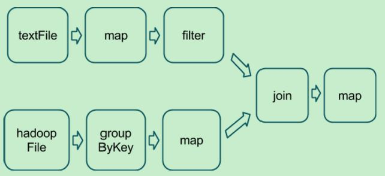
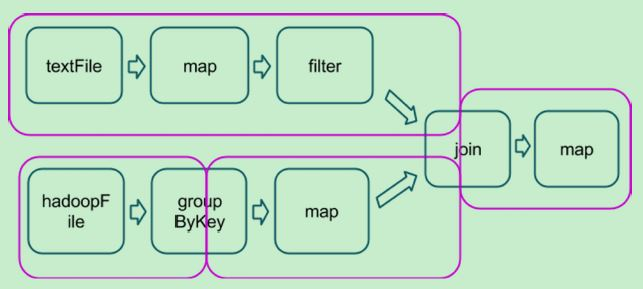

# Tuning Spark Applications
## Shuffle Overview
A Spark dataset comprises(vt.构成；包含) a fixed number of partitions, each of which comprises a number of records. For the datasets
returned by `narrow` transformations, such as `map` and `filter`, the records required to compute the records in a single
partition reside(vi.居住；属于；存在) in a single partition in the parent dataset. Each object is only dependent on a single object in the parent.
Operations such as `coalesce` can result in a task processing multiple input partitions, but the transformation is still
considered narrow because the input records used to compute any single output record can still only reside in a limited
subset of the partitions.

Spark also supports transformations with `wide` dependencies, such as `groupByKey` and `reduceByKey`. In these
dependencies, the data required to compute the records in a single partition can reside in many partitions of the parent
dataset. To perform these transformations, all of the tuples with the same key must end up in the same partition,
processed by the same task. To satisfy this requirement, Spark performs a `shuffle`, `which transfers data around the
cluster and results in a new stage with a new set of partitions`.

For example, consider the following code:
```
sc.textFile("someFile.txt").map(mapFunc).flatMap(flatMapFunc).filter(filterFunc).count()
```
It runs a single action, `count`, which depends on a sequence of three transformations on a dataset derived(adj.衍生的) from a text
file. This code runs in a single stage, because none of the outputs of these three transformations depend on data that
comes from different partitions than their inputs.
In contrast, this Scala code finds how many times each character appears in all the words that appear more than 1,000
times in a text file:
```
val tokenized = sc.textFile(args(0)).flatMap(_.split(' '))
val wordCounts = tokenized.map((_, 1)).reduceByKey(_ + _)
val filtered = wordCounts.filter(_._2 >= 1000)
val charCounts = filtered.flatMap(_._1.toCharArray).map((_, 1)).reduceByKey(_ + _)
charCounts.collect()
```
This example has three stages. The two reduceByKey transformations each trigger stage boundaries, because computing
their outputs requires repartitioning the data by keys.

A final example is this more complicated transformation graph, which includes a join transformation with multiple
dependencies:



The pink boxes show the resulting stage graph used to run it:



At each stage boundary, data is written to disk by tasks in the parent stages and then fetched over the network by
tasks in the child stage. Because they incur high disk and network I/O, stage boundaries can be expensive and should
be avoided when possible. The number of data partitions in a parent stage may be different than the number of
partitions in a child stage. `Transformations that can trigger a stage boundary typically accept a numPartitions
argument, which specifies into how many partitions to split the data in the child stage`. Just as the number of reducers
is an important parameter in MapReduce jobs, the number of partitions at stage boundaries can determine an
application's performance.

## Choosing Transformations to Minimize Shuffles
You can usually choose from many arrangements(n.安排；布置；准备) of actions and transformations that produce the same results.
However, not all these arrangements result in the same performance. Avoiding common pitfalls(误区) and picking the right
arrangement can significantly improve an application's performance.
When choosing an arrangement of transformations, minimize the number of shuffles and the amount of data shuffled.
Shuffles are expensive operations; all shuffle data must be written to disk and then transferred over the network.
`repartition` , `join`, `cogroup`, and any of the `*By` or `*ByKey` transformations can result in shuffles. Not all these
transformations are equal, however, and you should avoid the following patterns:
* groupByKey when performing an associative(adj.联合的；组成的；联想的) reductive operation. For example,rdd.groupByKey().mapValues(_.sum) produces the same result as rdd.reduceByKey(_ + _). However,
the former transfers the entire dataset across the network, while the latter computes local sums for each key in
each partition and combines those local sums into larger sums after shuffling.

* reduceByKey when the input and output value types are different. For example, consider writing a transformation
that finds all the unique strings corresponding to each key. You could use map to transform each element into a
Set and then combine the Sets with reduceByKey:

```
rdd.map(kv => (kv._1, new Set[String]() + kv._2)).reduceByKey(_ ++ _)
```
This results in unnecessary object creation because a new set must be allocated for each record.
Instead, use aggregateByKey, which performs the map-side aggregation more efficiently:

```
val zero = new collection.mutable.Set[String]()
rdd.aggregateByKey(zero)((set, v) => set += v,(set1, set2) => set1 ++= set2)
```
* flatMap-join-groupBy. When two datasets are already grouped by key and you want to join them and keep
them grouped, use cogroup. This avoids the overhead associated with unpacking and repacking the groups.

## When Shuffles Do Not Occur

In some circumstances(n.情况；境遇；事项；详细情节), the transformations described previously do not result in shuffles. Spark does not shuffle when
a previous transformation has already partitioned the data according to the same partitioner. Consider the following
flow:

```
rdd1 = someRdd.reduceByKey(...)
rdd2 = someOtherRdd.reduceByKey(...)
rdd3 = rdd1.join(rdd2)
```

Because no partitioner is passed to reduceByKey, the default partitioner is used, resulting in rdd1 and rdd2 both
being hash-partitioned. These two reduceByKey transformations result in two shuffles. If the datasets have the same
number of partitions, a join requires no additional shuffling. Because the datasets are partitioned identically, the set
of keys in any single partition of rdd1 can only occur in a single partition of rdd2. Therefore, the contents of any single
output partition of rdd3 depends only on the contents of a single partition in rdd1 and single partition in rdd2, and
a third shuffle is not required.
